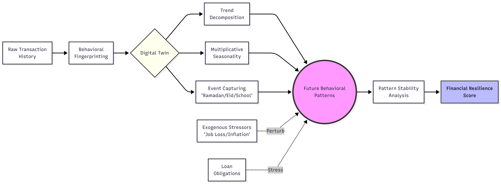
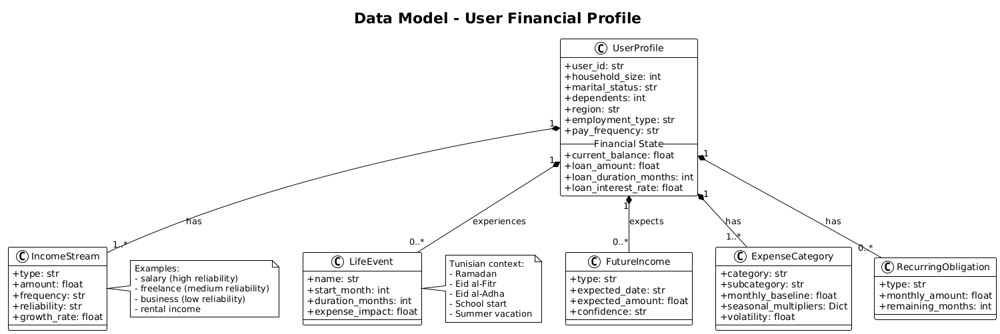
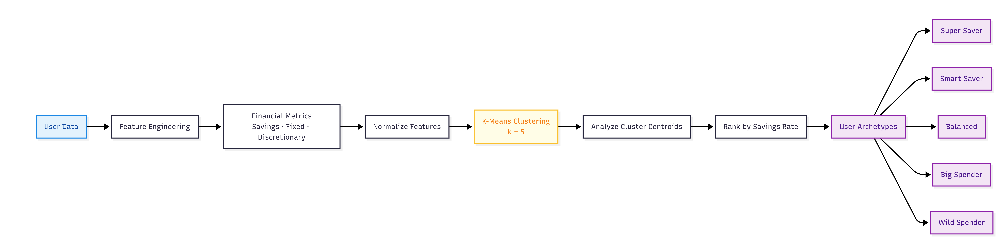
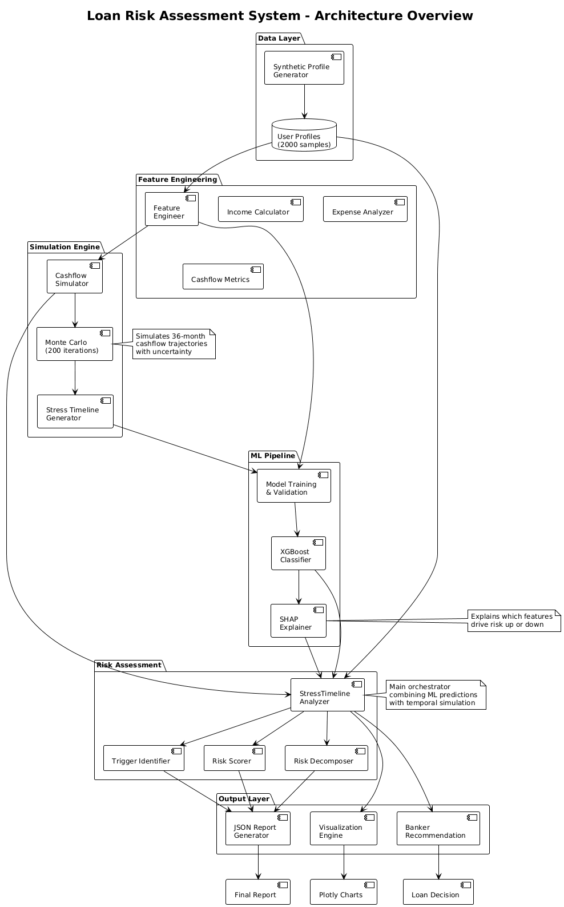
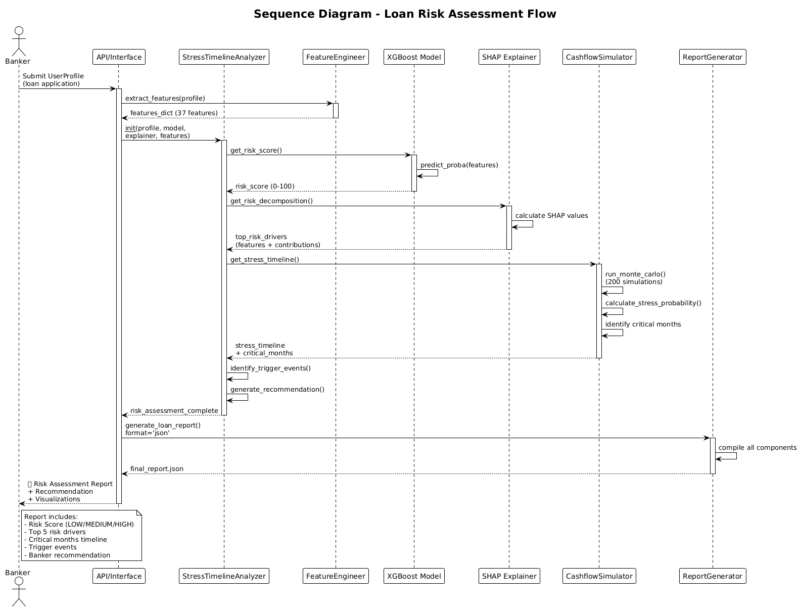

<p align="center">
  
</p>

<h1 align="center">TwinSight - Financial Digital Twin</h1>

<p align="center">
  <b>Anticipatory Banking for the Tunisian Context</b><br>
  <i>Empowering users through behavioral simulation and resilience modeling.</i>
</p>

<p align="center">
  <a href="http://34.155.235.146:3000/">
    
  </a>
</p>

---

## 🌟 Overview
TwinSight creates a **Financial Digital Twin** that goes beyond static accounting. It simulates a user's financial "DNA" to project future outcomes, allowing users to navigate high-risk periods (like Ramadan, Eid, or Back-to-School) with AI-powered foresight.

### 🧬 The Digital Twin Flow
The core of TwinSight is the transformation of raw transaction history into a behavioral model.
<p align="center">
  
</p>

### 📊 Behavioral Data Model
The "Financial DNA" of a user is synthesized into a standardized data model, capturing spending velocity, savings ratios, and liquidity buffers.
<p align="center">
  
</p>

---

## 🚀 Key Features (Frontend Experience)

The **TwinSight Dashboard** provides high-fidelity simulations and actionable insights:

1.  **Balance Projection (The Multiverse Simulator)**: Uses **Prophet ML** to project your balance 6 months into the future. Unlike basic linear math, it simulates thousands of scenarios (Monte Carlo) to show confidence bands.
2.  **Tunisian Lifecycle Awareness**: Automatically adjusts for regional spending spikes:
    *   🌙 **Ramadan**: Food & charity increases.
    *   🐏 **Eid al-Adha**: Large occasional expenses.
    *   🎓 **Back to School**: Education-related liquidity dips.
3.  **Stress Testing**: "What if I lose my job for 3 months?" or "What if inflation hits 20%?". The app perturbs your digital twin and extracts a **Resilience Score**.
4.  **Advisor Dashboard**: A dedicated view for financial advisors to analyze client risk with full explainability and approve/reject loan requests.

---

## 🧠 Machine Learning Architecture

The project is built on three main behavioral pillars:

### 1. User Archetyping (Clustering)
We categorize users into 5 distinct spending profiles using K-Means clustering on behavioral ratios (Savings Rate, Fixed vs. Discretionary costs).
<p align="center">
  
</p>

### 2. Time-Series Forecasting (Prophet)
The system decomposes spending into **Trend + Seasonality + Holiday Shocks**. This allows us to predict not just *what* you will spend, but the *pattern* of your future financial life.

### 3. Loan Risk & Readiness
Instead of static credit scores, we use a dynamic risk assessment based on projected future stability.
<p align="center">
  
</p>

---

## 🏗️ Repository Structure

| Component | Path | Description |
|-----------|------|-------------|
| **Frontend** | `FrontEnd/` | Next.js, Recharts, Framer Motion, TypeScript |
| **Backend API** | `financial_twin_api/` | FastAPI, Prophet Integration, Pydantic |
| **Forecasting POC** | `POC_Prophet.ipynb` | The "Brain" - Tunisian context modeling |
| **Clustering POC** | `POC_User_Categorization.ipynb` | Behavioral segmentation engine |
| **Risk Modeling** | `loan_risk_breakdown_nb.ipynb` | Explainable AI for loan readiness |

---

## 🛠️ Technical Stack

- **UI/UX**: React 18, Next.js (App Router), Tailwind CSS, Lucide Icons.
- **Charts**: Recharts (for Monte Carlo bands and projections).
- **ML Engine**: Facebook Prophet, Scikit-learn (K-Means).
- **API**: FastAPI (Python 3.10+), Uvicorn.
- **Data**: Pandas, NumPy, SQLite (for demo persistence).

---

## 🚦 Getting Started

### 1. Launch the ML Backend
```bash
cd financial_twin_api
pip install -r requirements.txt
python -m uvicorn app.main:app --reload --port 8000
```

### 2. Launch the Frontend
```bash
cd FrontEnd
pnpm install
pnpm dev
```

---

## 📊 Sequence Logic
The interaction between the user, the Digital Twin, and the Risk Engine follows this automated flow:
<p align="center">
  
</p>

---

## 📜 License
MIT - Created for the **WeHelp Hackathon**.